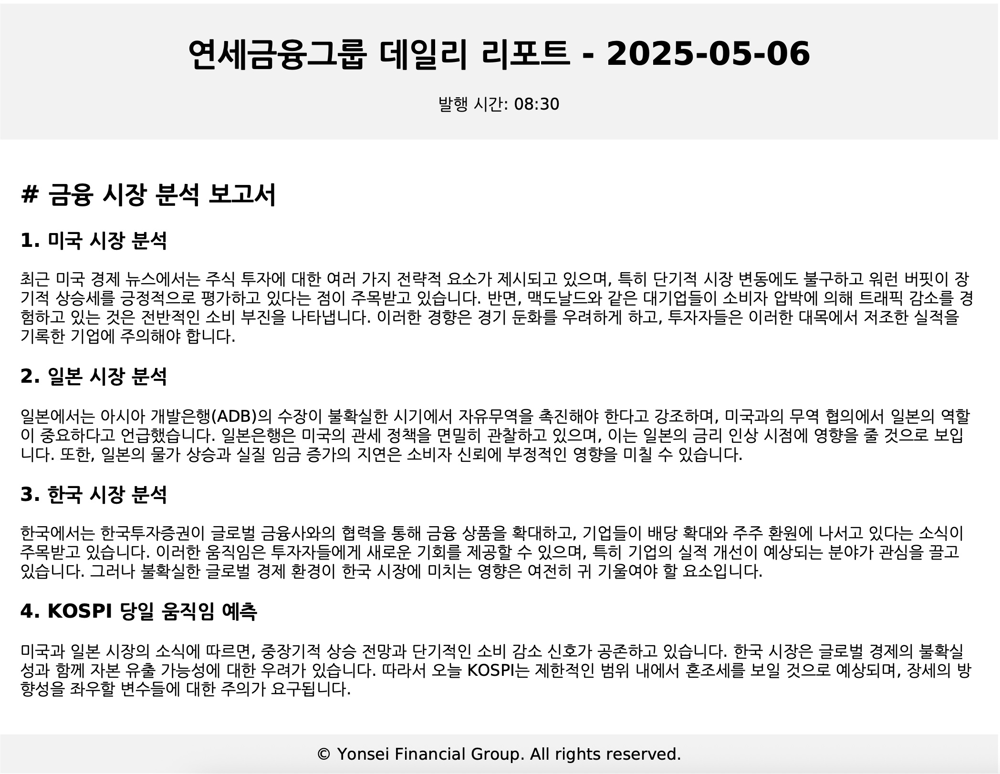

# Finance News Agent

This project scrapes recent financial news from the US, Japan, and Korea, generates a financial analysis report for each country, and predicts the KOSPI (Korean stock market index) movement for the day. The analysis and report generation are powered by AI.

## Features

- Scrapes the latest financial news headlines and summaries from:
    - Yahoo Finance (US)
    - The Japan News by The Yomiuri Shimbun (Japan)
    - Money Today (Korea)
- Uses an AI model (GPT-4o-mini via OpenAI API) to:
    - Analyze the news from the three countries.
    - Generate a consolidated report in Korean covering market insights, potential impacts, opportunities, risks, and a KOSPI prediction.
- Generates a daily report in PDF format, styled for "Yonsei Financial Group".

## Sample Output

Here is an example of the generated PDF report:



## Technology Stack

- Python 3.12
- `uv` for dependency management
- `requests` and `beautifulsoup4` for web scraping
- `openai` for AI-driven analysis and report generation
- `python-pdfkit` for generating PDF reports (requires `wkhtmltopdf`)

## Setup

### Prerequisites

1.  **Python 3.12:** Ensure you have Python 3.12 installed.
2.  **uv:** Install the `uv` package manager if you haven't already. See [uv documentation](https://github.com/astral-sh/uv) for installation instructions.
3.  **System Dependencies:** Install `wkhtmltopdf` and Korean fonts. On Debian/Ubuntu-based systems:
    ```bash
    sudo apt update
    sudo apt install wkhtmltopdf fonts-nanum -y
    ```
4.  **OpenAI API Key:** You need an API key from OpenAI.

### Installation

1.  **Clone the repository:**
    ```bash
    git clone <repository-url> # Replace <repository-url> with the actual URL
    cd finance-news-agent
    ```
2.  **Set up Environment Variable:**
    Create a `.env` file in the project root directory and add your OpenAI API key:
    ```env
    OPENAI_API_KEY='your_openai_api_key_here'
    ```
3.  **Install Python dependencies:**
    Use `uv` to sync the dependencies specified in `pyproject.toml` and `uv.lock`:
    ```bash
    uv sync
    ```

## Usage

Run the main script using `uv`:

```bash
uv run python main.py
```

This will:
1. Scrape the news.
2. Send the news data to the OpenAI API for analysis and KOSPI prediction.
3. Generate an HTML report based on the analysis.
4. Convert the HTML report to a PDF file named `yonsei_financial_report_YYYY-MM-DD.pdf` and save it in the `assets/` directory.
5. Print status messages and token usage to the console.

The generated PDF report will be located in the `assets` folder.
